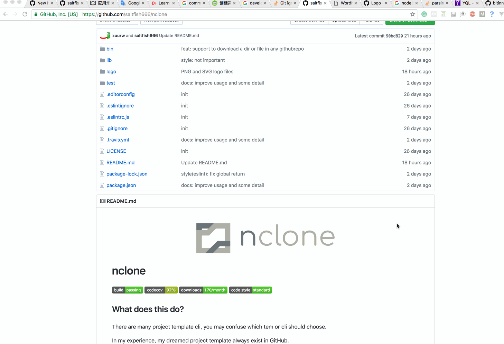

<p align="center">
  
</p>


# nclone
[](https://travis-ci.org/saltfish666/nclone)
[](https://codecov.io/gh/saltfish666/nclone)

[](https://standardjs.com)


## What does this do?
There are many project template cli, you may confuse which tem or cli should choose.

In my experience, my dreamed project template always exist in GitHub.

This cli can copy a github project's dir-tree and file.

You can set dir-tree or file-tree's depth.



## How to use?

```
$ npm i nclone -g

//$ nclone [repo] [targetDir] [-t=YOU_ACCESS_TOKEN] [-d=10] [-f=1]
$ nclone saltfish666/nclone ./nclone
```
`repo` is a github repo ,must format as USER/REPO such as

- `saltfish666/nclone`
- `https://github.com/saltfish666/nclone`
- `https://github.com/saltfish666/nclone/blob/master/bin/clone.js`
- `https://github.com/saltfish666/nclone/tree/master/bin`

`targetDir` is where you want to save files default as `./nclone`.

**warnning: it will rewirte file if file already exists before version 0.0.2**

it will not rewirte file since v0.0.3 or later.

- `-t` should be you access token to touch api.github.com

- `-d` is dir depth that you want to copy defalut as 10

- `-f` is file depth that you want to copy defalut as 1

## next-release
- use git-clone if access_token does not exist
- should memory repo setting history
- should store token

